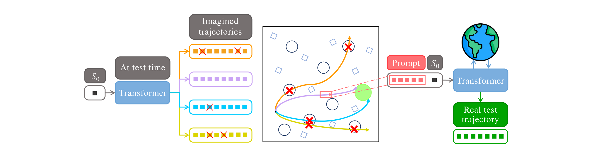
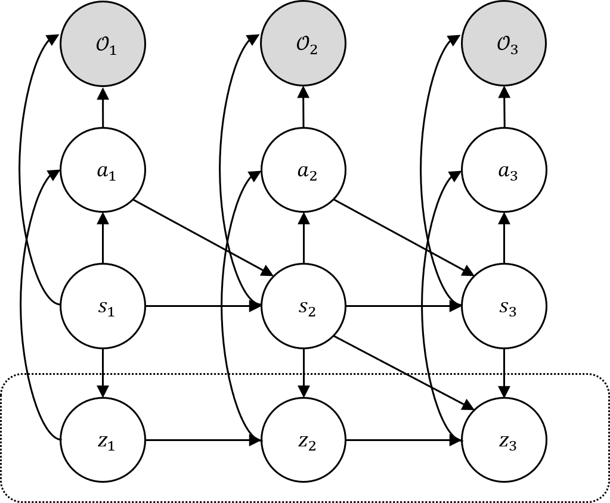
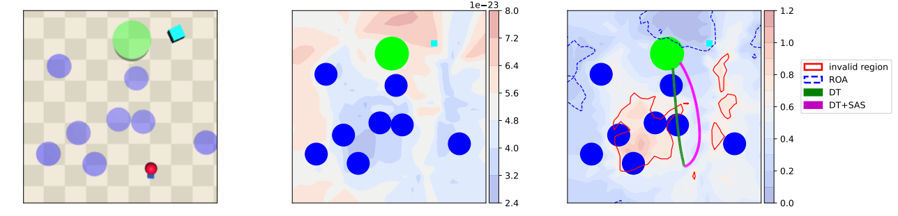

# SAS: Lyapunov-Guided Self-Alignment for Offline Safe Reinforcement Learning

[🌐 Project Page](https://seungyubhan.github.io/sas/) &nbsp;|&nbsp; [📄 Paper](https://openreview.net/forum?id=GPNwYOQECX) &nbsp;|&nbsp; [💻 Code](https://github.com/seungyubhan/sas)

Official implementation of **SAS (Self-Alignment for Safety)**, a transformer-based
framework for **test-time adaptation in offline safe RL without retraining**.

> **Lyapunov-Guided Self-Alignment: Test-Time Adaptation for Offline Safe
> Reinforcement Learning**
> Seungyub Han\*, Hyungjin Kim\*, Jungwoo Lee
> *Accepted at AISTATS 2026*

<p align="center">
  
</p>

## Overview

Offline RL agents often fail at deployment because the gap between the training
distribution and the real environment drives the agent into unsafe regions. SAS
addresses this without any additional training by exploiting the transformer
backbone as both a **world model** (via a VAE-augmented Decision Transformer)
and an **in-context learner**.

At test time, SAS proceeds in three steps:

1. **Imagine.** From a fixed initial state, the pretrained transformer rolls out
   several imagined trajectories under its learned dynamics.
2. **Filter with Lyapunov.** Each rollout is scored with the Lyapunov model
   `G_SAS(s, a)`, a density-based surrogate derived from the estimated
   occupancy measure, which identifies control-invariant segments.
3. **Re-prompt.** The safest segment is recycled as an in-context prompt,
   realigning the agent's policy toward safer behavior.

<p align="center">
  
</p>

The framework admits a probabilistic-inference interpretation: Lyapunov
verification is reformulated as maximizing the log-likelihood of two binary
observables `U_t`, `V_t`, and prompt-based alignment corresponds to Bayesian
inference over latent high-level skills in a hierarchical RL policy.
Under mild assumptions, Theorem 4 gives a formal bound on the probability of
leaving the control-invariant set, which decays exponentially in the number of
imagined rollouts.

### Key Contributions

- A Lyapunov stability criterion for offline RL expressed through
  **occupancy measures**.
- A **hierarchical RL** interpretation of transformer-based RL via Bayesian
  inference over latent skills.
- **SAS**, a Lyapunov-guided self-alignment procedure that uses imagined
  trajectories as in-context safety prompts.
- Empirical results on MuJoCo, Safety Gymnasium, and Bullet-Safety-Gym: SAS
  reduces cost and failure rate by up to **2×** while maintaining or improving
  return.

<p align="center">
  
</p>

## Installation

Experiments require **MuJoCo**, **Safety-Gymnasium**, and **DSRL**. Follow the
instructions in the [mujoco-py repo](https://github.com/openai/mujoco-py) to set
up MuJoCo, then create the conda environment:

```bash
conda env create -f conda_env.yml
conda activate self-aligning-dt
```

## Datasets

All datasets are cached under the `data/` directory.

**MuJoCo (D4RL).** Download a single D4RL dataset, e.g. Hopper with the
`medium` proficiency:

```bash
python data/download_d4rl_datasets.py --env Hopper-v3 --proficiency medium
```

**Safety Gymnasium / DSRL.** Download the expert dataset for a single task,
e.g. `OfflinePointGoal1-v0`:

```bash
python data/download_dsrl_datasets.py --env OfflinePointGoal1-v0
```

Or download every DSRL task used in the paper in one go:

```bash
python data/download_dsrl_datasets.py --download_all
```

## Training and Evaluation

Train a Decision Transformer backbone and evaluate it on MuJoCo:

```bash
python experiment.py --env hopper --dataset medium --exp_name tmp
```

Train on a Safety Gymnasium task:

```bash
python experiment.py --env dsrl_pointgoal1 --exp_name tmp
```

Run SAS test-time adaptation on a saved checkpoint. This evaluates both the
backbone DT and DT+SAS side-by-side:

```bash
python experiment.py --env dsrl_pointgoal1 --exp_name tmp --load
```

In the output logs:

- `test/returns`, `test/costs`, `test/failures` are the metrics for the
  **backbone** (DT or CDT).
- `test/return_prom`, `test/costs_prom`, `test/failures_prom` are the metrics
  for **backbone + SAS** (i.e. DT+SAS or CDT+SAS).

### Supported environments

The `--env` flag accepts:

- MuJoCo: `hopper`, `walker2d`, `humanoid`
- Safety Gymnasium (via DSRL): `dsrl_pointgoal1`, `dsrl_pointgoal2`,
  `dsrl_pointpush1`, `dsrl_pointpush2`, `dsrl_pointbutton1`,
  `dsrl_pointbutton2`, `dsrl_cargoal1`, `dsrl_cargoal2`, `dsrl_carpush1`,
  `dsrl_carpush2`, `dsrl_carbutton1`, `dsrl_carbutton2`
- DSRL velocity tasks: `dsrl_halfcheetah`, `dsrl_swimmer`, `dsrl_walker2d`

See `utils/set_env.py` for default episode lengths, return targets, and
normalization scales per task.

## Repository Layout

```
sas/
├── experiment.py                       # training / evaluation entry point
├── conda_env.yml                       # conda environment
├── data/
│   ├── download_d4rl_datasets.py       # MuJoCo (D4RL) downloader
│   └── download_dsrl_datasets.py       # Safety Gymnasium (DSRL) downloader
├── decision_transformer/
│   ├── models/                         # Decision Transformer + VAE world model
│   ├── training/                       # sequence / action trainers
│   └── evaluation/                     # episode rollouts, SAS prompt generation
├── utils/
│   └── set_env.py                      # per-environment configuration
└── imgs/                               # figures used in this README
```

The SAS prompt-generation procedure (Algorithm 1 in the paper) lives in
`decision_transformer/evaluation/evaluate_episodes.py`, and the Lyapunov-aware
rollout / generation modes are implemented in
`decision_transformer/models/decision_transformer.py`.

## Citation

If you find this work useful, please cite:

```bibtex
@inproceedings{han2026sas,
  title     = {Lyapunov-Guided Self-Alignment: Test-Time Adaptation for
               Offline Safe Reinforcement Learning},
  author    = {Han, Seungyub and Kim, Hyungjin and Lee, Jungwoo},
  booktitle = {Proceedings of the 29th International Conference on Artificial
               Intelligence and Statistics (AISTATS)},
  year      = {2026}
}
```

## Acknowledgments

This work was supported in part by the National Research Foundation of Korea
(NRF) (grant numbers RS-2024-00451435 and RS-2024-00413957) and the Institute
of Information & Communications Technology Planning & Evaluation (IITP).

Our codebase builds on the excellent
[Decision Transformer](https://github.com/kzl/decision-transformer) and
[DSRL](https://github.com/liuzuxin/DSRL) implementations.
