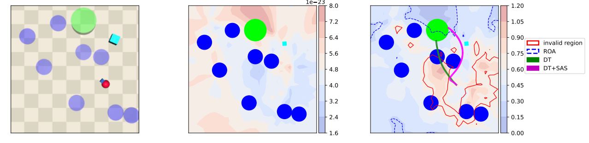

# Self-Aligning RL Agent Behavior To Be Safe: Zero-Shot Lyapunov-Conditioned Self-Alignment for RL

We provide some additinoal figures to help the reviewers to understand the proposed method.

## illustration of SAS graphical model (hidden markov model)

## Additional Visualization of Figure 3 on different environment settings

We note that the pretrined DT by using expert safeRL agent fails to dodge the hazard zone even if it learns to constrain the cost return. However, our method, DT+SAS succesfully align the above DT agent to dodge the hazard and follow the most probable behaviors to be safe.

